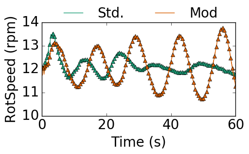

Running multiple turbines on one core
-------------------------------------

The native version of FAST is capable of handling several different turbines when running on one core. However, this capability breaks down when FAST is used with an external library like a externally defined bladed-style controller for ServoDyn or user defined routines in ServoDyn and ElastoDyn. All variables used in subroutines of externally defined libraries become global variables by default. This leads to a conflict when using the same external library for multiple turbines. In a private discussion, Bonnie suggested that FAST could work with multiple turbines if the external libraries used for each turbine had different names as shown in Figure :num:`multiturbinediscon`.

.. _multiturbinediscon:

   How to run multiple turbines on a single core in FAST with external bladed-style controller libraries.

.. _sec-multipleTurbinesTestNativeFAST:

Test with native FAST
+++++++++++++++++++++

I tested this concept in the `tryMultTurbinesNativeFAST <https://github.com/gantech/fastv8DriverProgram/tree/tryMultTurbinesNativeFAST>`_ branch. The FAST archive contains a *standard* example bladed-style controller ``DISCON.f90``. I created a *modified* controller by altering certain parameters in `DISCON2.f90 <https://github.com/gantech/fastv8DriverProgram/blob/tryMultTurbinesNativeFAST/fastv8/CertTest/5MW_Baseline/ServoData/Source/DISCON2.f90>`_ as:

.. code-block:: fortran
   
   REAL(4), PARAMETER :: PC_KI = 0.008965149 ! Integral gain for pitch controller at rated pitch (zero), (-). Copied from OC3 Hywind case
   REAL(4), PARAMETER :: PC_KP = 0.006275604 ! Proportional gain for pitch controller at rated pitch (zero), sec. Copied from OC3 Hywind case
   REAL(4), PARAMETER :: PC_MinPit = 0.05235987755982988 ! Minimum pitch setting in pitch controller, rad. - Setting randomly to 3 degrees

I modified the FAST source code to run two turbines that were identical except for the controllers specified in external libraries as ``libDISCON_glin64.so`` and ``libDISCON2_glin64.so``. Figure  :num:`nativefasttwoturbinetest` shows that the two turbines respond differently to the same inflow conditions. Specifically, Figure :num:`nativefasttwoturbinetestbldpitch` shows that the blade pitch of the turbine with the modified controller hits the lower limit of :math:`3^{\circ}` as specified in ``DISCON2.f90``. In addition Figure :num:`nativefasttwoturbinetest` also compares the output of each tubine to that obtained using a single turbine in FAST. I have verified that the output from FAST when run using two turbines simultaneously is the same as that obtained when running them individually upto the precision used in the binary output file.

.. subfigstart::
   
.. _nativefasttwoturbinetestbldpitch:

.. figure:: images/nativeFASTtwoTurbineTest_08_19_2016/compare_t1_test18_t2_test18_BldPitch1.png
   :width: 100%
   :align: center
   
   Blade pitch

.. _nativefastwoturbinetestrotspeed:

   
   Rotor speed

.. subfigend::
   :width: 0.47
   :label: nativefasttwoturbinetest
   
   Time history of (a) blade pitch and (b) rotor speed of two turbines with different controllers using the ``fortran`` driver program. The triangles correspond to the same case run using a single turbine in FAST.

Also, I modified the ``FAST_Subs`` module to write out different checkpoint files for each turbine and restart from them. I also fixed a bug that now enables the output file :sidenote:`<binaryOutput> FAST stores all the information to be written to the binary output file during the simulation. It then writes them all out at the very end.` for all the turbines to be written out separately.

Develop capability in C driver
++++++++++++++++++++++++++++++

The main ``C`` driver program remains the same for any number of turbines on a core. Any changes to the code to accomodate multiple turbines happen in the ``C++`` interface and ``FAST_Library.f90``. At a high level, the looping over different turbines could be done either inside ``fortran`` (``FAST_Library.f90``) or in the ``C++`` interface class. I don't see any technical advantage for one approach over another. However, the required work is different in the two cases as follows:

* if done in ``Fortran``: all the existing subroutines should be unbound from ``C`` and new wrapper subroutines have to developed with almost the same arguments.
* if done in ``C++``: all the existing subroutines could be reused with minimal changes. This is likely to lower the likelihood of any errors during the development process.

Hence, I'm going to go ahead with looping over the turbines in ``C++``.

The main change that should happen in ``FAST_Library.f90`` is that the ``Turbine`` variable should become an array of turbines. ``FAST_Library.f90`` should include a variable for the total number of turbines. Since the ``Turbine`` variable is now an allocatable array, there has to be a routine that allocates the memory for this array.  All routines should receive an extra argument ``iTurb`` and should use ``Turbine(iTurb)`` instead of just the variable ``Turbine``. 

Test03
++++++

Test03 makes sure that the glue code runs correctly with two turbines on one core. Test03 is a replica of the test described in Sec :ref:`sec-multipleTurbinesTestNativeFAST` with the C++ glue-code. The input file looks as:

.. code-block:: yaml

    nTurbines: 2
    restart: False
    tStart:  0.0
    tEnd:    10.0
    tMax:    60.0
    ntStart: 0
    ntEnd:   1600
    dtFAST:  0.00625
    nEveryCheckPoint: 1600
    
    Turbine1:
      TurbinePos: [ 0.0, 0.0, 0.0 ]
      numScOutputs: 0
      numScInputs: 0
      restartFileName: "banana"
      FASTInputFileName: "t1_Test03.fst"
      TurbID:  1
    
    Turbine2:
      TurbinePos: [ 0.0, 0.0, 0.0 ]
      numScOutputs: 0
      numScInputs: 0
      restartFileName: "banana"
      FASTInputFileName: "t2_Test03.fst"
      TurbID:  2

Test03 passes in commit `b3e7e07e642 <https://github.com/gantech/fastv8DriverProgram/commit/b3e7e07e64200d8d833a580087ceed3d7ca601d1>`_.